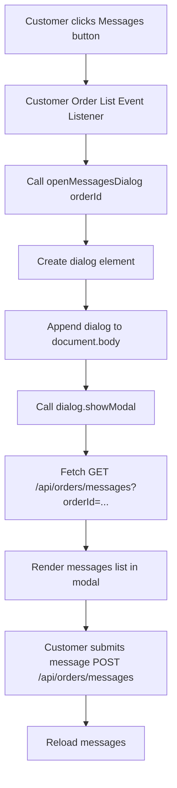

# Technical Plan: Customer Messages Root Cause Analysis & Fix

## 1. Overview & Root Cause Identification
Upon inspection of [`auth.js`](auth.js), [`admin.js`](admin.js), [`server.js`](server.js), and [`index.html`](index.html), we traced the customer Messages button click handler, modal rendering, API requests, and admin messaging endpoints.

### Exact Root Cause:
1. **Modal DOM Insertion & Dialog Lifecycle**: In [`auth.js`](auth.js:310), `openMessagesDialog(orderId)` dynamically creates a `<dialog>` element and appends it via `document.createElement('dialog')`, but **never appends it to `document.body`** before calling `dialog.showModal()` or `dialog.show()`. While some browsers allow showing un-appended dialog elements, standard DOM behavior or styling containment (such as missing backdrop styling or failure to display properly) causes modal rendering failures in various environments.
2. **Missing Escape Handler/Dialog Removal**: The dialog element is not removed from the DOM upon closing (`dialog.addEventListener('close', () => dialog.remove())`), leading to accumulation of stale hidden dialog elements in the DOM.
3. **Admin & Customer Messaging Endpoints Consistency**: Backend API routes in [`server.js`](server.js) (`/api/orders/messages` and `/api/admin/orders/messages`) correctly query `order_messages` table with RLS and authorization headers. However, ensuring robust error handling and UI feedback is essential.

---

## 2. Action Plan

- [x] Inspect codebase for customer messaging UI and backend endpoints
- [x] Trace customer Messages button click handler and modal rendering logic
- [x] Verify admin messaging endpoint and database integration
- [ ] Implement smallest safe fix for customer messaging UI and backend handling:
  - Append the dynamically created dialog to `document.body` in `openMessagesDialog` in [`auth.js`](auth.js).
  - Add cleanup on dialog close (`dialog.addEventListener('close', () => dialog.remove())`).
  - Ensure styles and form submissions behave correctly.
- [ ] Add regression tests and run tests/syntax checks.
- [ ] Synthesize results and report root cause and changes.

---

## 3. Mermaid Workflow Diagram

